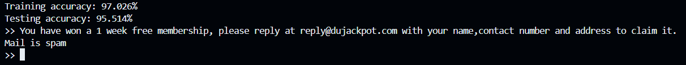

# Spam Email Detector

This project implements a spam email detector using TF-IDF vectorization and logistic regression. The `main.py` script trains the model and allows users to input emails continuously for spam detection until they type "exit" to quit.

## Overview

This spam email detector leverages two key techniques:

1. #### TF-IDF Vectorization

- TF-IDF helps convert each email into a numerical vector that represents its content, emphasizing words that are more specific to individual emails rather than common across all emails. This transformation is crucial for machine learning algorithms to process and classify textual data effectively.

2. #### Logistic Regression
- Logistic regression is a type of supervised learning algorithm used for binary classification tasks, such as spam vs. non-spam email detection.

## Usage

#### Installation

1. Clone the repository:
`git clone https://github.com/your-username/spam-email-detector.git`
`cd spam-email-detector`
2. Install dependencies:
`pip install -r requirements.txt`

#### Running the Detector

Run the spam email detector:
`python main.py`

#### How to Use

1. **Training the Model**: Upon running `main.py`, the script will automatically train the spam email detector using the provided dataset.

2. **Detecting Spam Emails**: After training, you can input email text when prompted. The detector will classify the input as spam or not spam using the trained logistic regression model and TF-IDF vectorization.

3. **Exiting the Program**: Type "exit" to exit the program.

## Contributing

Contributions are welcome! If you'd like to improve the accuracy, add features, or suggest enhancements, please feel free to submit a pull request.

## License

This project is licensed under the MIT License - see the LICENSE file for details.

